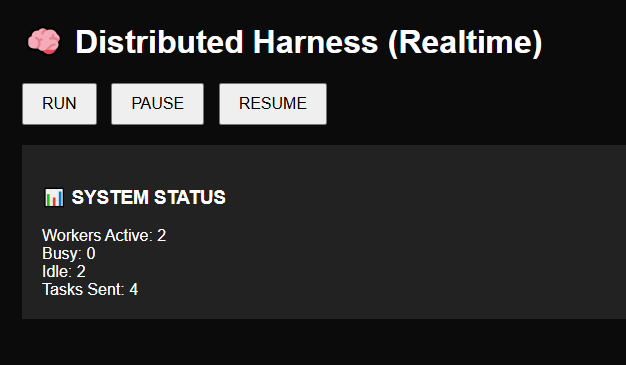
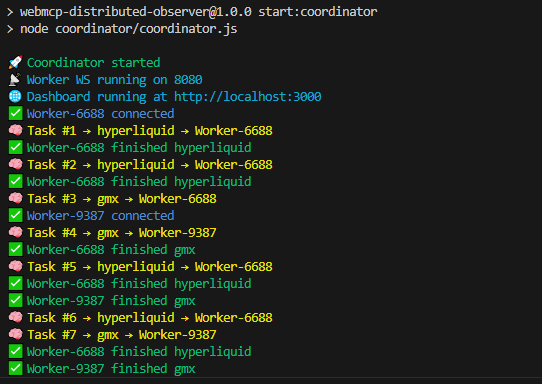
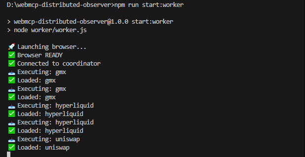
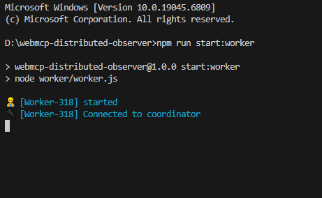
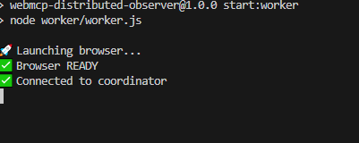

# 🧠 WebMCP Distributed Autonomous Web Observability Harness


A **distributed, self-healing Playwright automation infrastructure** designed to continuously monitor live web trading interfaces using autonomous browser workers.

This project demonstrates **Automation Infrastructure Engineering**, moving beyond traditional test automation into:

* Distributed orchestration
* Autonomous browser execution
* Realtime observability
* Control-plane driven automation systems

---

## 🚀 Project Vision

Modern QA platforms should behave like **engineering infrastructure**, not test scripts.

This system implements:

✅ Distributed browser workers
✅ Centralized control plane
✅ Autonomous task scheduling
✅ Live observability dashboard
✅ Self-healing execution model

---

## ⚡ Quick Start (Run Locally)

Clone repository:

```bash
git clone https://github.com/baliyanravi08-code/webmcp-distributed-observer.git
cd webmcp-distributed-observer
```

Install dependencies:

```bash
npm install
```

Install Playwright browsers:

```bash
npx playwright install
```

Start Coordinator:

```bash
npm run start:coordinator
```

Start Worker (open new terminal):

```bash
npm run start:worker
```

Start additional workers (optional):

```bash
npm run start:worker
npm run start:worker
```

Open dashboard:

```
http://localhost:3000
```

---

## ✅ Requirements

* Node.js ≥ 18
* npm ≥ 9
* Windows / macOS / Linux

⚠️ Playwright browsers must be installed before running workers.

---

## 🏗️ System Architecture

```
                    🧠 Planner Engine
                          │
                          ▼
               🚀 Coordinator (Control Plane)
      ┌──────────────────────────────────────────┐
      │  Scheduler + Worker Registry             │
      │  Status Aggregation                      │
      │  Distributed Task Dispatcher             │
      └──────────────────────────────────────────┘
                          │
              WebSocket Task Distribution
                          │
        ┌─────────────────┼─────────────────┐
        │                 │                 │
        ▼                 ▼                 ▼
   👷 Worker-1       👷 Worker-2       👷 Worker-3
   Playwright        Playwright        Playwright
   Browser Agent     Browser Agent     Browser Agent
        │                 │                 │
        └──────────── UI Monitoring ────────┘
                          │
                          ▼
             📊 Realtime Observability Dashboard
```

---

## ⚙️ Architecture Flow

```
Planner Engine
      ↓
Coordinator (Control Plane)
      ↓
Distributed Workers
      ↓
Live Browser Monitoring
      ↓
Realtime Dashboard Updates
```

---

## ⭐ Core Features

### 🧱 Distributed Harness Execution

* Multiple autonomous Playwright workers
* Horizontal scaling model
* Persistent single-tab browser agents
* Independent execution lifecycle

---

### 🧠 Coordinator Control Plane

* Worker registration
* Scheduling engine
* Task orchestration
* Cluster state tracking

---

### 📡 WebSocket Communication

* Worker ↔ Coordinator messaging
* Dashboard realtime streaming
* Low-latency distributed updates

---

### ❤️ Self-Healing Execution

* Worker disconnect cleanup
* Idle / Busy tracking
* Continuous monitoring loop

---

### 📊 Realtime Observability Dashboard

Live monitoring shows:

* Active workers
* Execution state
* Distributed task flow
* Total processed tasks

Dashboard updates automatically via WebSockets.

---

## 🖥️ Dashboard

Open locally:

```
http://localhost:3000
```

Realtime updates — no refresh required.

---

## 📸 System Execution

### 📊 Realtime Observability Dashboard



### 🚀 Coordinator Distributed Execution



### ⚡ Distributed Task Execution



### 👷 Workers Connected


### 🟢 Worker Startup



### 💤 Worker Idle State



---

## 📂 Project Structure

```
coordinator/
   coordinator.js     → Control Plane + Scheduler

worker/
   worker.js          → Distributed Browser Agent

checks/
   hyperliquid.check.js
   gmx.check.js
   uniswap.check.js

dashboard/
   index.html         → Realtime Monitoring UI

assets/
   screenshots
```

---

## ▶️ Running the Distributed System

Coordinator starts orchestration layer:

```bash
npm run start:coordinator
```

Workers automatically join cluster:

```bash
npm run start:worker
```

Multiple workers simulate distributed execution.

---

## 🌐 Monitoring Targets

* Hyperliquid Trading UI
* GMX Exchange
* Uniswap Interface

Workers continuously navigate and validate live trading interfaces.

---

## 🔥 What Makes This Different

This is **NOT a traditional test framework**.

Instead of:

```
tests/
pageObjects/
specs/
```

This project demonstrates:

✅ Distributed automation infrastructure
✅ Autonomous browser agents
✅ Control-plane orchestration
✅ Observability-driven QA
✅ Platform-level automation engineering

---

## 🧠 Engineering Highlights

* Distributed worker cluster
* Persistent browser agents
* Scheduler-driven execution
* WebSocket telemetry
* Control-plane architecture
* Infrastructure-style automation

---

## 📈 Future Enhancements

* Worker auto-scaling
* Persistent task queues
* Execution metrics & tracing
* Docker / Kubernetes deployment
* AI planner integration
* Cloud distributed execution

---

## 👨‍💻 Tech Stack

* Playwright
* Node.js
* WebSockets
* Express
* Distributed System Design

---

## ⭐ Positioning

> **Distributed Autonomous Web Observability Harness**
> A platform-level QA automation infrastructure inspired by modern control-plane and observability systems.

---
